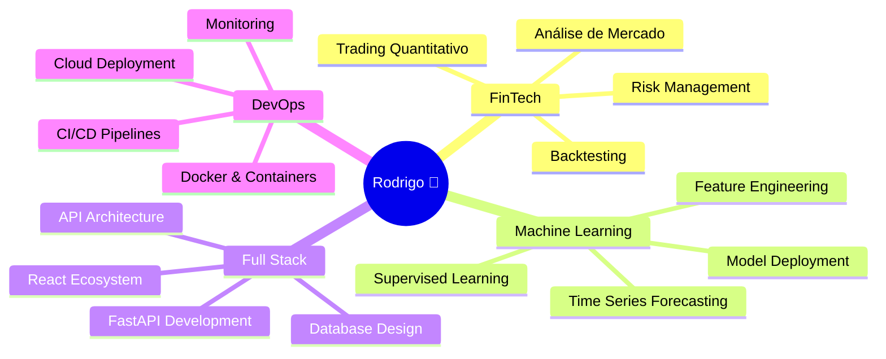

<div align="center">

<!-- Animated Header -->


### 🚀 Full Stack Developer | 🤖 ML Engineer | 📊 Quant Trader

<p>
  <a href="https://github.com/spwebfamily-crypto">
    
  </a>
  <a href="https://linkedin.com/in/seu-perfil">
    
  </a>
  <a href="mailto:seu-email@example.com">
    
  </a>
  <a href="https://seu-portfolio.com">
    
  </a>
</p>


</div>

---

## 🎯 Sobre Mim

```python
class Rodrigo:
    def __init__(self):
        self.name = "Rodrigo 🐐"
        self.role = "Full Stack Developer & ML Engineer"
        self.location = "Brasil 🇧🇷"
        self.languages = ["Python", "TypeScript", "JavaScript", "SQL"]
        self.passions = ["FinTech", "Quant Trading", "AI/ML", "Cloud Architecture"]
        
    def current_focus(self):
        return {
            "project": "AlphaView Dashboard",
            "learning": ["Deep Learning", "AWS Serverless", "Advanced Backtesting"],
            "building": "Production-grade trading platforms",
            "goal": "Transform data into actionable alpha 📊"
        }
    
    def say_hi(self):
        print("👋 Let's build something amazing together!")

me = Rodrigo()
me.say_hi()
```

<div align="center">

### 💡 "The GOAT doesn't wait for opportunities, he creates them." 🐐

</div>

---

## 🛠️ Arsenal Tecnológico

<div align="center">

### 💻 Core Languages


### 🎨 Frontend Development


### ⚙️ Backend Development


### 🗄️ Databases & Storage


### 🤖 AI/ML & Data Science


### 🐳 DevOps & Cloud


### 🧪 Testing & Quality


</div>

---

## 🌟 Projetos em Destaque

<div align="center">

<table>
<tr>
<td width="50%">

### 📊 AlphaView Dashboard
**Plataforma Institucional de Trading Quantitativo**

🎯 **Highlights:**
- 🤖 ML models para sinais BUY/SELL/HOLD
- 📈 Backtesting engine robusto
- 🎨 Dashboard React glassmorphism
- 🐳 Arquitetura production-ready

**Stack:** Python • FastAPI • React • TypeScript • PostgreSQL • Docker

[](https://github.com/spwebfamily-crypto/AlphaView-Dashboard)

</td>
<td width="50%">

### 🚀 Seus Outros Projetos
**Adicione mais projetos aqui**

🎯 **Features:**
- ✨ Feature 1
- ✨ Feature 2
- ✨ Feature 3
- ✨ Feature 4

**Stack:** Suas tecnologias aqui

[](https://github.com/spwebfamily-crypto/seu-projeto)

</td>
</tr>
</table>

</div>

---

## 📊 GitHub Analytics

<div align="center">


</div>

---

## 🏆 GitHub Trophies

<div align="center">


</div>

---

## 💼 Expertise & Experiência

<div align="center">



</div>

### 🎯 Áreas de Domínio

<table>
<tr>
<td width="33%" align="center">

### 🏦 FinTech
- Trading Quantitativo
- Análise de Mercado
- Risk Management
- Portfolio Optimization
- Backtesting Engines

</td>
<td width="33%" align="center">

### 🤖 Machine Learning
- Supervised Learning
- Time Series Analysis
- Feature Engineering
- Model Deployment
- MLOps

</td>
<td width="33%" align="center">

### 💻 Full Stack
- React + TypeScript
- FastAPI + Python
- PostgreSQL
- Docker
- Cloud Architecture

</td>
</tr>
</table>

---

## 🎓 Filosofia de Desenvolvimento

<div align="center">

> ### "Clean code is not written by following a set of rules. You don't become a software craftsman by learning a list of what to do and what not to do."
> **— Robert C. Martin (Uncle Bob)**

</div>

### ⚡ Meus Princípios

```typescript
const codingPrinciples = {
  cleanCode: {
    readable: "Código que conta uma história",
    maintainable: "Fácil de modificar e estender",
    testable: "Cobertura de testes significativa"
  },
  architecture: {
    solid: "Princípios SOLID em prática",
    scalable: "Preparado para crescer",
    modular: "Componentes independentes"
  },
  performance: {
    optimized: "Rápido sem sacrificar clareza",
    efficient: "Uso inteligente de recursos",
    monitored: "Métricas e observabilidade"
  },
  collaboration: {
    documented: "Docs claros e atualizados",
    reviewed: "Code review rigoroso",
    shared: "Conhecimento compartilhado"
  }
};
```

---

## 🌱 Aprendizado Contínuo

<div align="center">

| 🎯 Foco Atual | 📚 Próximos Passos | 🔮 Futuro |
|---------------|-------------------|-----------|
| Deep Learning para Time Series | Kubernetes & Orchestration | Reinforcement Learning |
| AWS Serverless Architecture | Advanced Portfolio Theory | Distributed Systems |
| Advanced Backtesting | Real-time Data Streaming | Blockchain & DeFi |
| Performance Optimization | System Design Patterns | Quantum Computing |

</div>

---

## 📈 Contribuições

<div align="center">


</div>

---

## 💬 Citações Favoritas

<div align="center">

<table>
<tr>
<td>

> "First, solve the problem. Then, write the code."
> 
> — John Johnson

</td>
<td>

> "Make it work, make it right, make it fast."
> 
> — Kent Beck

</td>
</tr>
<tr>
<td>

> "Code is like humor. When you have to explain it, it's bad."
> 
> — Cory House

</td>
<td>

> "The best error message is the one that never shows up."
> 
> — Thomas Fuchs

</td>
</tr>
</table>

</div>

---

## 📫 Vamos Conectar!

<div align="center">

### 🚀 Aberto para oportunidades em:


---

### 📬 Entre em Contato

<p>
  <a href="https://github.com/spwebfamily-crypto">
    
  </a>
  <a href="https://linkedin.com/in/seu-perfil">
    
  </a>
  <a href="mailto:seu-email@example.com">
    
  </a>
  <a href="https://seu-portfolio.com">
    
  </a>
</p>

---


### ⭐ Se você gostou dos meus projetos, deixe uma estrela!

---


**Feito com ❤️, ☕ e muito 📊 | © 2024 Rodrigo 🐐**

</div>
