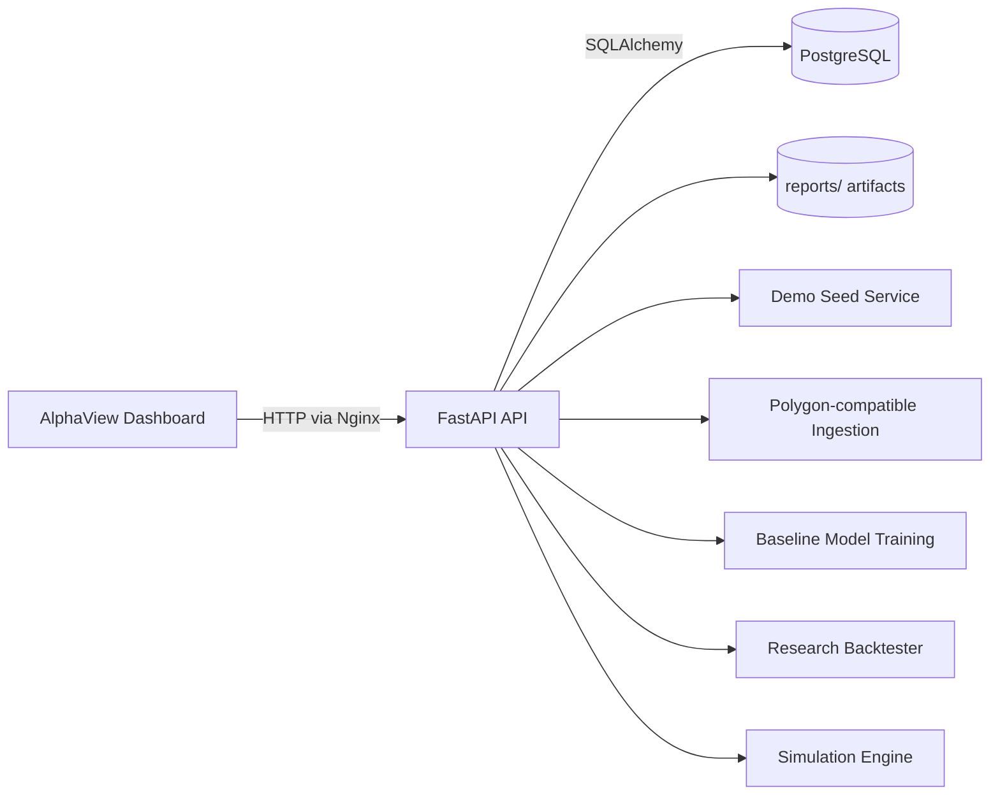

# Architecture

## Overview

AlphaView currently runs as three primary services:

1. PostgreSQL for persistence
2. FastAPI for ingestion, research, broker, and demo APIs
3. React/Vite dashboard, served as a static bundle by Nginx in Docker

## Backend boundaries

- `backend/app/core`: configuration and structured logging
- `backend/app/db`: engine and session management
- `backend/app/models`: relational domain entities
- `backend/app/services/market_data_service.py`: historical ingestion and synthetic fallback
- `backend/app/services/finnhub`: market-status checks, quotes, and explicit candle adapter
- `backend/app/services/feature_service.py`: feature engineering
- `backend/app/services/model_service.py`: training, registry, and inference
- `backend/app/services/backtest_service.py`: backtesting and report generation
- `backend/app/services/broker_service.py`: local execution simulator
- `backend/app/services/demo_service.py`: one-click demo seeding and snapshot assembly

## Frontend boundaries

- `frontend/src/App.tsx`: page orchestration and data loading
- `frontend/src/pages`: operator and buyer-facing dashboard pages
- `frontend/src/components`: layout, tables, badges, and charts

## Mermaid

## Runtime defaults

- execution mode defaults to `PAPER`
- external broker routing remains disabled by default
- demo mode works without external API keys through synthetic data generation
- in Docker, the frontend serves the built app and proxies `/api` traffic to the backend service

## Next hardening steps

- formalize Alembic migrations
- replace the mock broker layer with real IBKR paper execution
- improve live market streaming and multi-symbol portfolio simulation
